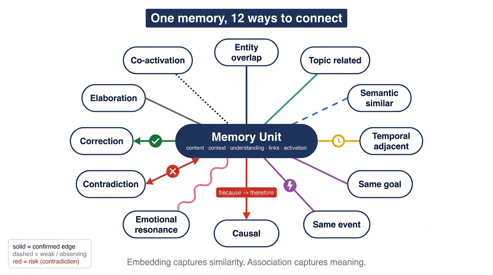
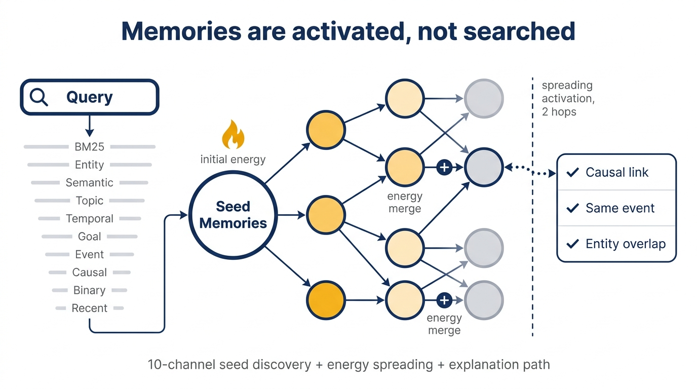
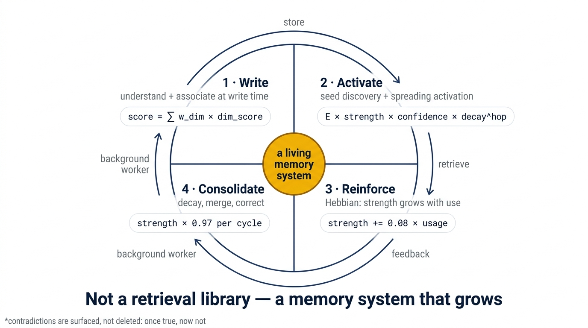
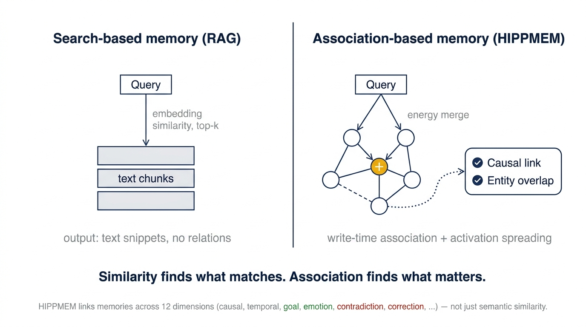

# Core Concepts

> This document explains HIPPMEM's core concepts in plain language. After reading it, you'll understand how the engine "thinks" without looking at the code — every description corresponds to actual behavior in the open-source code.
> Chinese reference: [Core Concepts and How It Works](zh/concepts.md). Want to jump straight to code? Head to the [Cookbook](cookbook.md).

---

## 1. What the engine does: an overview

HIPPMEM turns pieces of text into a **network of interlinked memories**: when you write, it finds relatives for the new memory (associations); when you ask, it dredges up the most relevant ones (retrieval); when you tell it right or wrong, it remembers your preference (feedback); and it periodically consolidates the network (learning and forgetting).

The whole system is four pipelines:

```
write ──→ retrieve ──→ feedback ──→ consolidate
index+link    recall+spread+rank    log+score    learn+summarize+forget
```

---

## 2. MemoryUnit: a card with content, understanding, associations, and a track record

A memory is not a plain document — it is a structured card (`crates/hippmem-core/src/model/unit.rs`) with four layers:

```
┌─────────────── MemoryUnit ───────────────┐
│ content:  "Switched to redb because      │  ← content: raw text + type + time
│            RocksDB was slow to compile"  │
│ understanding:                           │  ← understanding: auto-extracted
│   entities: [RocksDB, redb]              │      entities, topics, causality,
│   topics: [storage, compilation]         │      importance
│ association_keys: [entity keys, topic    │  ← association keys: for indexing
│   keys, time buckets]                    │
│ links:                                   │  ← out-edges: relationships to
│   → memory_42 (EntityOverlap)            │      older memories (see §3)
│   → memory_78 (Causal)                   │
│ activation:                              │  ← track record: usage history
│   retrieval_count: 5                     │
│   last_retrieved_at: 2026-08-12          │
│   usage_score: 0.7                       │
│ lifecycle: Active                        │  ← lifecycle: normal / compressed /
│ stage: Indexed                           │      deprecated; memory stage
└──────────────────────────────────────────┘
```

Key points:

- The **understanding layer is extracted automatically at write time** (entities, topics, causality, importance) — no manual annotation.
- **`links` (out-edges) only record "points to whom"**: the rope is attached to the new card, so the new card is its owner.
- **`lifecycle`**: `Active` → `Compressed` (compressed into a summary; the source memory retires but remains inspectable) or `Deprecated` (unused for a long time). Compressed/deprecated memories no longer participate directly in retrieval.
- **`usage_score`**: a cumulative record maintained by feedback (see §6). It does **not directly change retrieval scores** — retrieval goes through the association graph, not a global score.
- **`stage`**: the memory's life stage (see §4.1).

---

## 3. AssociationLink: the ropes between memories

When two memories share entities, are semantically close, or have causal/temporal relationships, the engine automatically builds an **association link** between them (`crates/hippmem-core/src/model/links.rs`).

### Link types

There are 14 link types; the common ones:

| Type | Meaning |
|------|---------|
| `EntityOverlap` | Shared entities (both mention Rust) |
| `SemanticSimilar` | Similar meaning |
| `Causal` | Causal relationship (A causes B) |
| `TemporalAdjacent` | Close in time |
| `SameGoal` / `SameEvent` | Same goal / same event |
| `CoActivation` | Frequently used together (learned during consolidation, see §7) |
| `Contradiction` | Contradict each other |

<p align="center">
  
</p>

### Three essentials of a link

- **strength (0–1)**: how strong the relationship is. **It is rewritten by learning and forgetting**: used together often → stronger; unused for long → weaker.
- **confidence (0–1)**: how certain the engine was when the link was formed.
- **direction**: **links point from the new memory to the older one** (one-way). Older memories are the "sources" of the network; newer memories hang behind them.

### Birth of a link: observation zone and confirmation

The write path creates links by association score (`crates/hippmem-write/src/edges.rs`):

```
score < 0.25   → no link (too weak to record)
0.25–0.55      → link created, in the observation zone (Observing: not yet certain)
> 0.55         → link created and confirmed (Confirmed)
```

Observation-zone links can be "promoted" if they are co-activated repeatedly later (see §7).

---

## 4. Write: what happens when a new memory comes in

`engine.write()` completes the following before returning (`crates/hippmem-engine/src/write_api.rs`):

1. **Understanding extraction**: entities, topics, causality, importance (local rule-based extractor — no external API required)
2. **Fingerprints**: SimHash (256-bit), binary code (128-bit), dense vector (when an embedder is available)
3. **Association keys**: entity / topic / time-bucket (hour/day/week) / goal / event / causal keys, all deterministically hashed
4. **Candidate discovery**: look up the new memory's keys in the **entity, topic, and temporal** inverted indexes to find possibly-related older memories
5. **Coarse filter**: sort by SimHash similarity, keep at most 30 candidates
6. **Multi-dimensional scoring**: compute an association score per candidate (entity overlap ×0.20 + semantic ×0.18 + topic ×0.10 + goal ×0.12 + causal ×0.10 + temporal ×0.10 + importance ×0.02 + shared-context ×0.03, with a bonus when many dimensions hit)
7. **Edge creation**: apply the §3 thresholds; a new edge's strength and confidence both equal the association score
8. **Persistence**: one transaction writes the memory itself plus six inverted indexes (entity/topic/goal/event/causal/temporal)
9. **Indexing**: add to the full-text index (BM25) and vector indexes; then asynchronously fill in deeper understanding (goals/events/causality)

**In one sentence**: at write time, the engine ties all the ropes for the new card and registers it in every index so it can be found later.

### 4.1 The staged memory pipeline

Every memory carries a `stage` field recording its life stage (`crates/hippmem-core/src/model/unit.rs`):

```
raw ──→ indexed ──→ enriched ──→ consolidated
```

| Stage | When | State |
|-------|------|-------|
| `raw` | Just submitted | Raw text, not yet processed |
| `indexed` | Before `engine.write()` returns (sync) | Understanding extracted, indexes and edges built — **a memory is already here when write() returns** |
| `enriched` | After write (async) | Deep understanding filled in (goals/events/causality), indexes updated |
| `consolidated` | During consolidation (async, scheduled) | Participated in Hebbian reinforcement, decay, possibly summary compression |

---

## 5. Retrieval: the full journey of one query

`engine.retrieve()` proceeds as follows (`crates/hippmem-engine/src/retrieve_api.rs`). Analogy: **the engine sends out several scouts, each bringing back a batch of "possibly relevant" cards by a different method; then the reports are merged, energy spreads along the ropes, and the results are ranked.**

### 5.1 Step 1: understand the query

The query gets the same extraction (entities, topics, causality), producing a "search instruction".

### 5.2 Step 2: multi-channel seed recall

Each channel is an independent angle for finding memories, returning "hit list + rank within channel". Each channel keeps at most its top 20 hits.

| Channel | How it finds | Hit score |
|---------|-------------|-----------|
| BM25 | Full-text inverted index, lexical match | tanh(score/2.0) normalized |
| Entity | Query entities → entity index | tiered by covered query entities: 0.2 / 0.35 / 0.5 (1 / 2 / 3+ covered) |
| Topic | Query topics → topic index | fixed 0.15 |
| Temporal | Current time buckets (hour/day/week) → temporal index | fixed 0.3 ("recent events") |
| Semantic (dense) | Query vector vs memory vectors (cosine similarity) | 1/(1+distance); vectors are persisted at write time and the index is rebuilt locally on reopen |
| Semantic (binary) | 128-bit Hamming distance | 1 − distance/128 |
| Goal | Goal words in query → goal index | hit count |
| Event | Event words in query → event index | hit count |
| Causal | "X→Y" causal pairs in query → causal index | hit count |
| Recent | Caller-declared `recent_memory_ids`: the ids themselves +0.3, their graph neighbors +0.15 | additive |

The memories directly hit by any channel are the **seeds** — the "starting points" of retrieval. The rank within each channel is kept (rank determines the fusion weight in the next step).

### 5.3 Step 3: RRF fusion — merging per-channel ranks into one score

Raw scores from different channels are not comparable (an entity hit of 0.2 and a tanh-normalized BM25 score share no scale), so the engine uses **ranks only**. This is RRF (Reciprocal Rank Fusion):

```
fused(id) = Σ (channel weight w) / (k + rank_in_channel)
```

- A memory ranked high in **several channels** gets a high fused score (multi-angle corroboration)
- Parameters: k = 1.0; BM25/entity/semantic/goal/event/causal/recent weights are 1.0, **topic and temporal are only 0.3** (their hits carry no frequency information, so they are trusted less)

### 5.4 Step 4: seed energy

The fused score is divided by the maximum fused score among this query's seeds (within-query normalization), then converted to energy:

```
seed_energy = min( (fused ÷ max_fused) × 0.40 × (1 + importance × 0.60), 1.0 )
```

- **0.40**: baseline weight for a direct hit; higher-**importance** memories get more energy
- Energy is capped at 1.0; seeds below 0.05 energy do not spread
- Note: normalization is **within-query**, so **scores are not comparable across queries** — a 0.75 in one query is not "better" than a 0.35 in another; each score only has ranking meaning inside its own query

### 5.5 Step 5: spreading activation — diffusing along the ropes

Seed memories carry energy along their out-edges to neighbors, simulating "A reminds me of B":

```
energy_to_neighbor = source_energy × strength × confidence × 0.55^hop × link_type_factor
```

- **0.55^hop**: energy is more than halved per hop. At most 2 hops by default
- **Link type factor**: causal edges have the highest factor (×1.30 — causal associations are the most valuable), others have their own factors
- Each path's energy is clamped to [0, 1]; when a memory receives energy from multiple paths it is merged as `max + 0.3 × second_max`
- Energy below 0.05 stops propagating; **compressed memories are dead ends** — energy cannot pass through them (since 0.4.0)

The **candidate set = seeds + memories reached by spreading**.

<p align="center">
  
</p>

### 5.6 Step 6: rerank and output

After sorting the candidate set by energy, four adjustments are applied:

1. **Question-type adjustment**: detect the question type ("why"/"what"...), apply a moderate boost to matching answer patterns (capped at 1.0)
2. **Compressed filter**: compressed source memories are removed from results (summaries are returned by default; sources remain inspectable)
3. **Recency correction**: a multiplicative correction inside the candidate set (see §6):

```
final_energy = energy × (1 + 0.15 × confirm_count / global_max_confirm_count)
```

   At most +15%, applied only to memories already in the candidate set — it is a **tie-break within the same relevance tier**, and can never pull a weakly relevant memory over a strongly relevant one.
4. **Entity coverage correction**: for multi-entity queries (N ≥ 2 query entities, e.g. "what is the relationship between X and Y?"), a candidate covering k of the query's entities is multiplied by `(1 + 0.2 × k/N)` — the answer must involve both entities, so full-coverage memories win within their tier and single-entity word-surface decoys (memories sharing only one entity word with the query) fall behind. Single-entity queries are unaffected.

The final ordering is **deterministic**: the same store state + the same query → bit-identical scores and order.

### 5.7 Step 7: bookkeeping

- Write this retrieval into the **activation log**: `retrieval_id`, result set, signal="retrieve", timestamp
- Update the track record of the returned memories: retrieval count +1, last retrieved time, co-activation counts with the same batch

---

## 6. Feedback: you tell the engine "right or wrong"

`engine.feedback()` accepts four signals (`crates/hippmem-engine/src/signals.rs`):

| Signal | Meaning | Polarity |
|--------|---------|----------|
| `Referenced` | User referenced this memory | Positive, weak |
| `TaskSucceeded` | A task based on this memory succeeded | Positive, medium |
| `UserConfirmedCorrect` | User confirmed the result is correct | Positive, strong |
| `UserRejected` | User flagged it as wrong | Negative |

Each feedback does two things:

1. **Immediately**: update the memory's `usage_score` (confirm +0.10 / succeed +0.08 / reference +0.05 / reject −0.10, clamped to [0,1]) — a **record field** that does not change retrieval scores directly
2. **Bookkeeping**: write an activation-log record. This record has two downstream consumers:
   - **Immediate**: the recency correction in the next retrieval (§5.6's ×(1+0.15×ratio))
   - **Long-term**: co-activation statistics during consolidation → edge reinforcement (§7)

### Two semantics of rejection

| Rejection form | Meaning | Effect |
|----------------|---------|--------|
| With a memory list (targeted) | "these are wrong" | During consolidation, the listed memories' association edges are weakened (§7 reverse-Hebbian) — they become harder to reach through the graph; **a rejection never strengthens any memory** |
| Empty list (result-set) | "the whole result set was wrong" (trap questions: the store has no answer) | **No memory-side effects**, kept in the activation log for audit only. Trap questions trigger this signal by construction, so letting it penalize the result set would permanently suppress innocent memories |

---

## 7. Consolidation: background learning

<p align="center">
  
</p>

`engine.consolidate()` runs periodically, in four steps (`crates/hippmem-consolidation/src/`):

### 7.1 Co-activation statistics

Take positive-signal records (confirm/succeed/reference) from the activation log, pair the memories of each record **two by two**, merge within a short window (about 1 hour), weighted by signal (confirm 1.0 / succeed 0.8 / reference 0.5). Output: `(memory A, memory B, weighted co-activation count)`.

### 7.2 Hebbian reinforcement — "neurons that fire together, wire together"

Named after Hebb's law. The rule (`crates/hippmem-consolidation/src/hebbian.rs`):

```
If A and B have a link and the weighted co-activation count ≥ 3:
    new_strength = min(strength + 0.08 × min(count, 5), 1.0)
If there is no link but the count is high enough: create a CoActivation link (initial strength 0.3)
```

- **Only counts ≥ 3 take effect**: a single confirmation does not reinforce a link immediately — the engine only trusts "repeatedly appearing together"
- **Capped at 1.0**: links never grow unbounded

### 7.3 Reverse Hebbian — the long-term effect of rejection

For a targeted rejection, the rejected memory's own links and every link pointing at it are **weakened in both directions** (−0.08, floor 0.12) — "you explicitly said it's wrong, so it becomes harder to recall through its associations".

### 7.4 Decay and pruning — forgetting

- **Time decay**: links inactive for more than 1 day are multiplied by 0.97, floored at 0.12 (`hebbian.rs`) — relationships fade gradually but never vanish
- **Pruning**: weak links below the threshold are removed; memories with no out-edges and no updates for 30 days are marked `Deprecated`

### 7.5 Summary compression — turning verbose memories into distilled ones

- Group **similar, low-importance** memories into clusters (similarity threshold 0.7, at least 12 members, importance < 0.5)
- Each cluster produces one high-level summary memory; the sources are marked `Compressed` and no longer hit retrieval directly (they stay in storage, inspectable)
- Links pointing at the sources are **redirected to the summary** — the summary becomes reachable through the graph as an upward view
- Memories already covered by a summary are never summarized again

Consolidation is **idempotent**: running it repeatedly neither duplicates links nor re-compresses (since 0.4.0).

---

## 8. Three guarantees

1. **Scores never grow without bound**: seed energy capped at 1.0, propagation energy clamped to [0,1], link strength capped at 1.0, context-link correction capped at ×1.5 (link strength capped at 1.0 × boost 0.5) — the absolute ceiling of a retrieval score is about 1.5. Frequent use raises scores, but they converge instead of "skyrocketing".
2. **Retrieval does not reinforce itself**: plain retrieval produces no positive signal (`signal="retrieve"` is not a positive signal) — otherwise frequently-returned memories would snowball.
3. **Confirmations do not reach across queries**: a confirmation binds the answer to the query's context (entity/topic fingerprint) and lifts it only in later queries whose fingerprint intersects that context — an unrelated query borrows nothing. The lift accumulates across confirmations, always scoped to the context.

---

## 9. The essential difference from "vector similarity search"

| | Vector search | HIPPMEM spreading activation |
|----|---------------|------------------------------|
| Recall mechanism | One-shot similarity match | Multi-channel seeds + graph diffusion |
| Result source | Direct hits only | Up to 1–2 hop indirect associations |
| Explainability | "vector distance 0.87" | "spread from memory 42 via a Causal edge" |
| Cold start | Requires building a vector index first | BM25 + entity rules always available |

<p align="center">
  
</p>

---

## 10. Deterministic degradation: runs with zero external dependencies

HIPPMEM can run end-to-end without any external API. This is achieved via the **deterministic degradation backend**: local rules and hash functions stand in for LLMs and external embedding services.

| Capability | API backend | Deterministic degradation |
|------------|-------------|---------------------------|
| Embedding | External embeddings (e.g. 1536-dim) | Deterministic hash (256-bit) |
| Entity/topic extraction | LLM | Rules: proper-noun detection + POS tagging |
| Causal extraction | LLM | Rules: connector matching ("because…so…", "leads to", "then") |
| Summarization | LLM | Extractive: key sentences + entity list |

Deterministic semantic accuracy is indeed lower (a 256-bit SimHash is no match for 1536-dim dense vectors), but **the core loop (write → index → retrieve → feedback → consolidate) fully works**. This gives three practical benefits:

- CI tests need no API key
- Offline environments are deployable
- Privacy-sensitive scenarios keep data on the local machine

---

## 11. A complete example: the life of one memory

Using "Xiao Ming and Li Hua are high school classmates":

```
Write        New memory arrives → extract entities [Xiao Ming, Li Hua] → index
             → build association links to older memories
Round 1      Query: "What is the relationship between Xiao Ming and Li Hua?"
             → entity/BM25/semantic channels hit → seed energy 0.31 (rank 3)
             → result confirmed by the user → one activation-log record
Round 2      Recency correction: it is the most-frequently-confirmed memory
             → 0.31 × 1.15 ≈ 0.35
             (lifted once within its tier; it does not accumulate per round)
Later        Consolidation: its co-activation count with the "same project
             group" memory accumulates; after 3, that link starts being
             reinforced (+0.08 × count, capped at 1.0) — this reshapes the
             reachability network so related memories are recalled together
Disuse       Link strength decays over time (×0.97/day, floor 0.12)
```

---

## 12. Capability overview

| # | Capability | Meaning |
|---|------------|---------|
| 1 | Native memory model | Content + understanding + associations + track record as one unit |
| 2 | Write-time structured understanding | Auto-extract entities/topics/events/causality |
| 3 | Write-time association discovery | Multi-dimensional candidate discovery + association scoring |
| 4 | Native association links | 14 link types + evidence + confidence |
| 5 | Multi-channel recall | BM25 + entity + semantic + temporal + graph diffusion |
| 6 | Spreading activation retrieval | 1–2 hops + edge-weight modulation + energy floor |
| 7 | Explanation paths | Results carry activation traces and matched dimensions |
| 8 | Activation log | Full recording of retrieval/usage/feedback |
| 9 | Hebbian reinforcement | Co-activation → edge reinforcement |
| 10 | Decay and pruning | Natural forgetting + weak-link cleanup |
| 11 | Contradiction detection | Auto-discovery of mutually contradictory memories |
| 12 | Causal tracing | Explicit causal extraction + Causal links |
| 13 | Deterministic degradation | Full loop with zero external APIs |

---

## 13. Further reading

- Chinese reference: [Core Concepts and How It Works](zh/concepts.md)
- Data structures: [Data Model](architecture/data-model.md)
- Algorithm details: [Algorithms](architecture/algorithms.md)
- API signatures and examples: [API Reference](api-reference.md)
