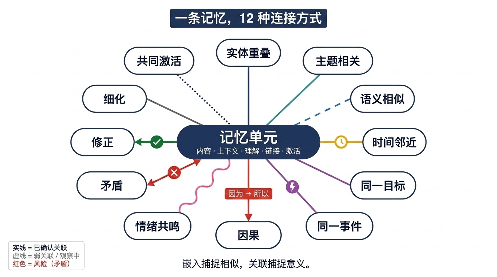
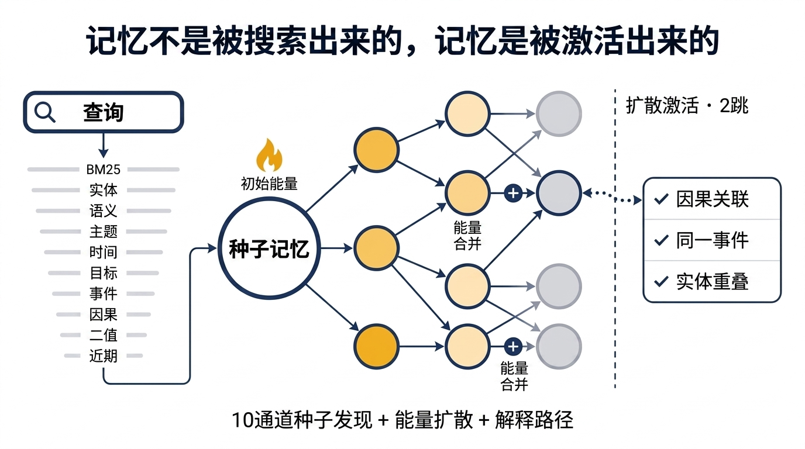
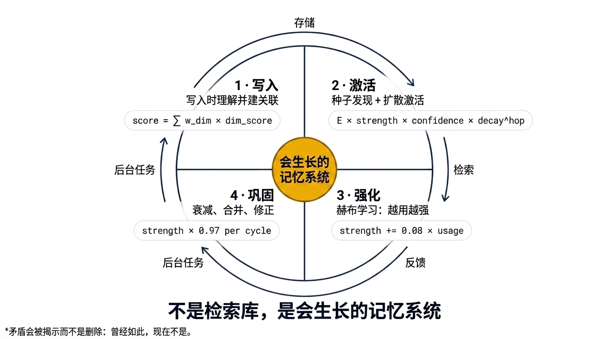
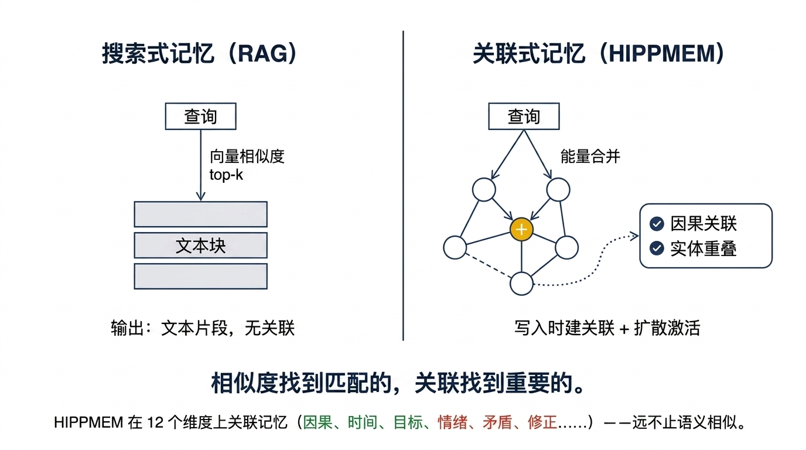

# 核心概念与工作原理

> 本文用平实的语言讲解 HIPPMEM 的工作原理：记忆如何存储、检索如何发生、反馈如何学习。读完本文，你将理解引擎"在想什么"——所有描述都对应开源代码中的实际行为。
> 英文权威版本：[Core Concepts](../concepts.md)。想看代码入口？见 [Cookbook](../cookbook.md)（英文）。

---

## 1. 引擎在做什么：一句话总览

HIPPMEM 把一段段文本变成一张**互相勾连的记忆网**：写的时候给新记忆找亲戚（建关联），问的时候从网里打捞最相关的几条（检索），你告诉它对错之后它记住你的偏好（反馈），并定期巩固这张网（学习与遗忘）。

整个系统由四道工序组成：

```
写（write）→ 查（retrieve）→ 评（feedback）→ 练（consolidate）
  建索引、建边    多通道召回+扩散+排序   记账、改分       学关联、压摘要、遗忘
```

---

## 2. 记忆（MemoryUnit）：一张"内容 + 理解 + 关联 + 履历"的卡片

一条记忆不是一个纯文本，而是一张结构化卡片（`crates/hippmem-core/src/model/unit.rs`），上面有四层信息：

```
┌─────────────── MemoryUnit ───────────────┐
│ content:  "小明和李华是高中同学"            │  ← 内容：原文 + 类型 + 时间
│ understanding:                            │  ← 理解：引擎自动抽取的结构化信息
│   entities: [小明, 李华]                  │      实体、主题、因果、重要度
│   topics: [同学关系]                      │
│ association_keys: [实体键, 主题键, 时间桶] │  ← 关联键：供索引查找
│ links:                                    │  ← 出边：与旧记忆的关系（见 §3）
│   → memory_42 (EntityOverlap)            │
│   → memory_78 (TemporalAdjacent)         │
│ activation:                              │  ← 履历：被用过几次、上次何时被捞
│   retrieval_count: 5                     │
│   last_retrieved_at: 2026-08-12          │
│   usage_score: 0.7                       │
│ lifecycle: Active                        │  ← 生命周期：正常/已压缩/已废弃
└──────────────────────────────────────────┘
```

要点：

- **理解层是写的时候自动抽取的**（实体、主题、因果、重要度），不需要人工标注。
- **`links`（出边）只记录"指向谁"**：绳子系在新卡片身上，新卡片就是绳子的主人（owner）。
- **`lifecycle`（生命周期）**：`Active`（正常）→ `Compressed`（被压成摘要，源记忆退役，但仍可查看）或 `Deprecated`（长期无人使用，废弃）。被压缩/废弃的记忆不再直接参与检索。
- **`usage_score`（使用价值分）**：由反馈维护的累积记录（见 §6）。它**不直接改变检索分数**——检索走的是关联图，不是全局分数。

---

## 3. 关联边（AssociationLink）：记忆之间的绳子

两条记忆共享实体、主题相近、有因果或时间关系时，引擎自动在它们之间建立**关联边**（`crates/hippmem-core/src/model/links.rs`）。

### 边的类型

边有 14 种类型，常见的有：

| 类型 | 含义 |
|------|------|
| `EntityOverlap` | 共享实体（都提到小明） |
| `SemanticSimilar` | 语义相近 |
| `Causal` | 因果关系（A 导致 B） |
| `TemporalAdjacent` | 时间相邻 |
| `SameGoal` / `SameEvent` | 同一目标 / 同一事件 |
| `CoActivation` | 经常一起被使用（巩固阶段学来的，见 §7） |
| `Contradiction` | 互相矛盾 |

<p align="center">
  
</p>

### 边的三个要义

- **strength（强度，0–1）**：这条关系有多牢。**会被学习和遗忘改写**：经常一起被用 → 变强；长期不用 → 变弱。
- **confidence（置信度，0–1）**：形成时的确定程度。
- **direction（方向）**：**边由新记忆指向旧记忆**（单向）。旧记忆是网的"源头"，新记忆挂在它后面。

### 边的出生：观察区与确认

写路径按关联分建边（`crates/hippmem-write/src/edges.rs`）：

```
关联分 < 0.25  → 不建边（关系太弱，不值得记录）
0.25–0.55      → 建边，进入观察区（Observing：还不确定）
> 0.55         → 建边，直接确认（Confirmed）
```

观察区里的边如果后来被反复共激活（见 §7），会被"转正"。

---

## 4. 写入：一条新记忆进库时发生了什么

`engine.write()` 在返回前完成（`crates/hippmem-engine/src/write_api.rs`）：

1. **理解抽取**：抽出实体、主题、因果、重要度（本地规则引擎，不依赖外部 API）
2. **生成指纹**：SimHash（256 位）、binary code（128 位）、dense 向量（如有嵌入器）
3. **生成关联键**：实体/主题/时间桶（时/日/周）/目标/事件/因果，全部确定性哈希
4. **候选检索**：拿键去**实体、主题、时间**倒排表里找可能是亲戚的旧记忆
5. **粗筛**：SimHash 相似度排序，最多保留 30 个候选
6. **多维评分**：对每个候选算关联分（实体重合×0.20 + 语义×0.18 + 主题×0.10 + 目标×0.12 + 因果×0.10 + 时间×0.10 + 重要度×0.02 + 上下文共享×0.03，命中维度多还有加成）
7. **建边**：按 §3 的阈值建边；新边的强度与置信度都等于关联分
8. **持久化**：一个事务写入记忆本体 + 六个倒排表（实体/主题/目标/事件/因果/时间）
9. **索引**：加入全文索引（BM25）与向量索引；随后异步补齐目标/事件/因果等深层理解

**一句话**：写入时，引擎就给新卡片系好了所有绳子，并登记进每个索引，让它以后能被找到。

### 记忆的生命阶段

每条记忆身上带着一个 `stage` 字段，记录它走过的人生阶段（`crates/hippmem-core/src/model/unit.rs`）：

```
raw ──→ indexed ──→ enriched ──→ consolidated
```

| 阶段 | 何时进入 | 状态 |
|------|---------|------|
| `raw` | 刚提交 | 原始文本，尚未处理 |
| `indexed` | `engine.write()` 返回前（同步） | 已抽取理解、已建索引与关联边——**写入完成时记忆已在此阶段** |
| `enriched` | 写入后（异步） | 补抽深层理解（目标/事件/因果），回写索引 |
| `consolidated` | 巩固阶段（异步、定期） | 参与过 Hebbian 强化、衰减、可能被摘要压缩 |

---

## 5. 检索：一次查询的完整旅程

`engine.retrieve()` 的完整流程如下（`crates/hippmem-engine/src/retrieve_api.rs`）。打个比方：**引擎派出多个侦察兵，每人用不同的方法带回来一批"可能相关的卡片"，然后情报汇总、沿着绳子扩散、最后排出名次。**

### 5.1 第一步：理解查询

对问题做同样的抽取（实体、主题、因果），得到"搜索指令"。

### 5.2 第二步：多通道种子召回

每个通道 = 一种独立的找记忆的角度，各自返回"命中列表 + 通道内排名"。每个通道最多取前 20 条。

| 通道 | 找法 | 命中记分 |
|------|------|---------|
| BM25 | 全文倒排，词面匹配 | tanh(分数/2.0) 归一化 |
| 实体（Entity） | 查询实体 → 实体倒排表 | 固定 0.2 |
| 主题（Topic） | 查询主题 → 主题倒排表 | 固定 0.15 |
| 时间（Temporal） | 当前时刻的时/日/周桶 → 时间倒排表 | 固定 0.3（"最近的事"） |
| 语义（dense） | 查询向量 vs 记忆向量（余弦相似度） | 1/(1+距离) |
| 语义（binary） | 128 位汉明码距离 | 1 − 距离/128 |
| 目标（Goal） | 查询中的目标词 → 目标倒排表 | 计数 |
| 事件（Event） | 查询中的事件词 → 事件倒排表 | 计数 |
| 因果（Causal） | 查询中的"X→Y"因果对 → 因果倒排表 | 计数 |
| 近期（Recent） | 调用方显式提供的 `recent_memory_ids`：本人 +0.3，其图邻居 +0.15 | 加性 |

这些被通道直接命中的记忆，就叫**种子（seed）**——检索的"起步点"。通道内排名会被保存下来（排名决定后面融合时的权重）。

### 5.3 第三步：RRF 融合——把各通道的排名合并成分数

不同通道的分值不可比（实体通道的 0.2 和 BM25 的 tanh 分数没有共同标尺），所以引擎**不用原始分，只用排名**。这就是 RRF（Reciprocal Rank Fusion，倒数排名融合）：

```
记忆的融合分 = Σ (通道权重 w) / (k + 通道内排名)
```

- 一条记忆在**多个通道里都排名靠前** → 融合分高（多角度印证）
- 参数：k = 1.0；BM25/实体/语义/目标/事件/因果/近期通道权重为 1.0，**主题和时间只有 0.3**（它们的命中不带词频信息，置信度低）

### 5.4 第四步：种子能量

融合分除以本次查询所有种子里的**最大值**（查询内归一化），再换算成能量：

```
种子能量 = min( (融合分 ÷ 最大融合分) × 0.40 × (1 + 重要度 × 0.60), 1.0 )
```

- **0.40**：种子命中的保底权重；**重要度**越高的记忆能量越强
- 能量上限 1.0；能量低于 0.05 的种子不参与传播
- 注意：归一化是**查询内**的，所以**不同查询之间的分数不能直接比较大小**——0.75 不一定比 0.35"更好"，只在各自查询内部有排名意义

### 5.5 第五步：传播（Spreading Activation）——沿着绳子扩散

种子记忆带着能量，沿出边向亲戚扩散，模拟人的"由 A 联想到 B"：

```
到邻居的能量 = 源能量 × 边强度 × 置信度 × 0.55^跳数 × 边类型系数
```

- **0.55^跳数**：每传一跳能量减半以上。默认最多 2 跳
- **边类型系数**：因果边系数最高（×1.30，因果关联最"值钱"），其余类型各有系数
- 每条路径的能量限制在 [0, 1]；一个记忆从多条路径收到能量时合并为：`最大 + 0.3 × 次大`
- 能量低于 0.05 不再继续传；**被压缩的记忆是死胡同**——能量不能穿过它（0.4.0 起）

于是**候选集 = 种子 + 被传播波及的记忆**。

<p align="center">
  
</p>

### 5.6 第六步：重排与输出

候选集按能量排序后，再动三处手脚：

1. **问题类型调整**：识别问题类型（"为什么"/"是什么"…），给匹配的答案模式适度加分（上限 1.0）
2. **压缩过滤**：被压缩的源记忆从结果中剔除（默认返回摘要，源记忆仍可查看）
3. **近期修正**：候选集内做乘法修正（见 §6）：

```
最终能量 = 能量 × (1 + 0.15 × 确认次数 / 全局最高确认次数)
```

   最多 +15%，只作用在已进候选集的记忆上——它是**同档竞争**（tie-break），不会把弱相关的记忆拉过强相关的记忆。

最终排序是**确定性的**：相同的存储状态 + 相同的查询 → 逐位相同的分数与顺序。

### 5.7 第七步：记账

- 把本次检索写入**激活日志（activation_log）**：`retrieval_id`、结果集、signal="retrieve"、时间
- 更新被返回记忆的履历：检索次数 +1、上次检索时间、与同批结果的共同激活计数

---

## 6. 反馈（feedback）：你告诉引擎"对不对"

`engine.feedback()` 收到四种信号（`crates/hippmem-engine/src/signals.rs`）：

| 信号 | 含义 | 作用 |
|------|------|------|
| `Referenced`（引用） | 用户引用了这条记忆 | 正向，弱 |
| `TaskSucceeded`（成功） | 基于这条记忆的任务成功 | 正向，中 |
| `UserConfirmedCorrect`（确认） | 用户确认结果正确 | 正向，强 |
| `UserRejected`（拒绝） | 用户标记为错误 | 负向 |

每条反馈做两件事：

1. **立即**：更新该记忆的 `usage_score`（确认 +0.10 / 成功 +0.08 / 引用 +0.05 / 拒绝 −0.10，范围 [0,1]）——这是**记录字段**，不直接改变检索分数
2. **记账**：写入激活日志。这条记录有两个下游消费者：
   - **即时**：下一轮检索的近期修正（§5.6 的 ×(1+0.15×频率比)）
   - **长期**：巩固阶段的共激活统计 → 边强化（§7）

### 拒绝的两种语义

| 拒绝形式 | 含义 | 效果 |
|---------|------|------|
| 带记忆列表（定向拒绝） | "这几条是错的" | 巩固时削弱这些记忆的关联边（§7 反向 Hebbian），它们更难被联想到；**拒绝永远不会强化任何记忆** |
| 空列表（结果集拒绝） | "这次检索全都不对"（陷阱题：库里没有答案） | **不产生任何记忆侧效果**，仅保留审计记录。因为陷阱题必然触发它，若让它压低结果集记忆，会永久压制无辜的记忆 |

---

## 7. 巩固（consolidate）：后台学习

<p align="center">
  
</p>

`engine.consolidate()` 定期运行，四步（`crates/hippmem-consolidation/src/`）：

### 7.1 共激活统计

从激活日志里取正信号记录（确认/成功/引用），把每条记录的记忆**两两组合**，短时间窗口（约 1 小时）内合并，按信号加权（确认 1.0 / 成功 0.8 / 引用 0.5）。产出：`(记忆A, 记忆B, 加权共激活次数)`。

### 7.2 Hebbian 强化——"一起激活的神经元连在一起"

名字来自赫布定律（fire together, wire together）。规则（`crates/hippmem-consolidation/src/hebbian.rs`）：

```
如果 A、B 之间有边，且加权共激活次数 ≥ 3：
    新强度 = min(旧强度 + 0.08 × min(加权次数, 5), 1.0)
如果没有边但共激活次数足够多：新建一条 CoActivation 边（初始强度 0.3）
```

- **≥ 3 次才生效**：单次确认不会立刻强化边——引擎要求"反复一起出现"才信
- **上限 1.0**：边不会无限强

### 7.3 反向 Hebbian——拒绝的长期效果

定向拒绝的记忆：它的边以及指向它的边**双向削弱**（−0.08），下限 0.12——"你明确说它错了，它就更难被联想到"。

### 7.4 衰减与剪枝——遗忘

- **时间衰减**：超过 1 天没被激活的边，强度 ×0.97，下限 0.12（`hebbian.rs`）——关系会慢慢淡，但不会消失
- **剪枝**：低于阈值的弱边被删除；没有出边且超过 30 天未更新的记忆 → 标记为 `Deprecated`（废弃）

### 7.5 摘要压缩——把啰嗦的变精炼

- 把**相似的、低重要度的**记忆聚成簇（相似度阈值 0.7，至少 12 条，重要度 < 0.5）
- 每个簇生成一条高层摘要记忆；源记忆标记为 `Compressed`（压缩），不再直接参与检索（但保留在存储中，可查看）
- 指向源记忆的边**重定向到摘要**——摘要从此可以通过关联图到达，成为"上卷视图"
- 已被摘要覆盖的记忆不会再次被摘要

巩固是**幂等**的：重复运行不会重复建边或重复压缩（0.4.0 起）。

---

## 8. 三个保证

1. **分数不会无限上涨**：种子能量上限 1.0、传播能量限制 [0,1]、边强度上限 1.0、近期修正 ≤ ×1.15——检索分数的绝对上限约为 1.15。频繁使用让分数上升，但会收敛，不会"涨上天"。
2. **检索不会自我强化**：仅检索不产生任何正向信号（`signal="retrieve"` 不是正信号）——否则常被捞出的记忆会滚雪球。
3. **确认不会跨查询越权**：确认频率只在候选集内做同档修正（≤ +15%），不会让"最近确认的"挤进与它无关的查询。

---

## 9. 与"向量相似度检索"的本质区别

| | 常规向量检索 | HIPPMEM 扩散激活 |
|----|---------------|------------------|
| 召回机制 | 一次性的相似度匹配 | 多通道种子 + 关联图扩散 |
| 结果来源 | 直接命中 | 可达 1–2 跳的间接关联 |
| 可解释性 | "向量距离 0.87" | "经由 Causal 边从记忆 42 扩散而来" |
| 冷启动 | 需要先建好向量索引 | BM25 + 实体规则随时可用 |

<p align="center">
  
</p>

---

## 10. 确定性降级：零外部依赖也能完整运行

HIPPMEM 可以在不调用任何外部 API 的情况下完整运行。这依靠**确定性降级后端**：本地规则与哈希算法替代 LLM 与外部嵌入服务。

| 能力 | API 后端 | 确定性降级 |
|------|---------|-----------|
| 嵌入 | OpenAI 等外部嵌入（如 1536 维） | 确定性哈希（256 位） |
| 实体/主题抽取 | LLM | 规则：专名检测 + 词性标注 |
| 因果抽取 | LLM | 规则：连接词匹配（"因为…所以…""导致"等） |
| 摘要 | LLM | 抽取式：关键句 + 实体列表 |

确定性降级的语义精度确实低于稠密向量（256 位 SimHash 无法与 1536 维向量相比），但**核心循环（写 → 索引 → 检索 → 反馈 → 巩固）全部可用**。这带来三个实际价值：

- CI 测试不需要任何 API key
- 离线环境可以部署
- 隐私敏感场景数据留在本机

---

## 11. 一个完整示例：一条记忆的一生

以"小明和李华是高中同学"为例：

```
写入      新记忆进库 → 抽实体[小明,李华] → 建索引 → 与旧记忆建关联边
第 1 轮查询  "小明和李华之间有什么关系？"
          → 实体/BM25/语义通道命中 → 种子能量 0.31（排名第 3）
          → 结果被用户确认 → 激活日志记一条
第 2 轮查询  确认频率修正：它是全场最高频确认者 → 0.31 × 1.15 ≈ 0.35
          （同档内抬升到位，此后不再变化——修正是一次性的，不是每轮累加）
之后每轮    巩固阶段：它与"同一项目组"记忆的共激活次数累计
          达到 3 次后 → 这对关联边开始被强化（+0.08×次数，上限 1.0）
          ——它改变的是"沿边可达"的关系网，让相关记忆更容易一起被想起
长期不用    边的强度随时间衰减（×0.97/天，下限 0.12）
```

---

## 12. 能力总览

| # | 能力 | 含义 |
|---|------|------|
| 1 | 原生记忆模型 | 内容 + 理解 + 关联 + 履历作为一个整体 |
| 2 | 写入时结构化理解 | 自动抽取实体/主题/事件/因果 |
| 3 | 写入时关联发现 | 多维度候选检索 + 关联评分 |
| 4 | 原生关联边 | 14 种边类型 + 证据 + 置信度 |
| 5 | 多通道召回 | BM25 + 实体 + 语义 + 时间 + 图扩散 |
| 6 | 扩散激活检索 | 1–2 跳 + 边权重调制 + 能量下限 |
| 7 | 解释路径 | 检索结果附带激活轨迹与命中维度 |
| 8 | 激活日志 | 检索/使用/反馈的完整记录 |
| 9 | Hebbian 强化 | 共激活 → 边强化 |
| 10 | 衰减与剪枝 | 自然遗忘 + 弱边清理 |
| 11 | 矛盾检测 | 自动发现互相矛盾的记忆 |
| 12 | 因果追踪 | 显式因果抽取 + Causal 边 |
| 13 | 确定性降级 | 零外部 API 完整跑通全循环 |

---

## 13. 进一步阅读

- 英文权威版：[Core Concepts](../concepts.md)
- 数据结构定义：[Data Model](../architecture/data-model.md)（英文）
- 算法细节：[Algorithms](../architecture/algorithms.md)（英文）
- API 签名与示例：[API Reference](../api-reference.md)（英文）
